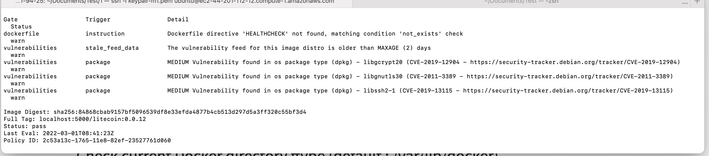
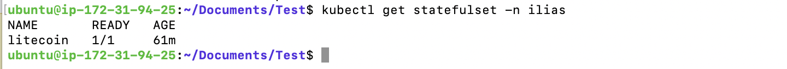
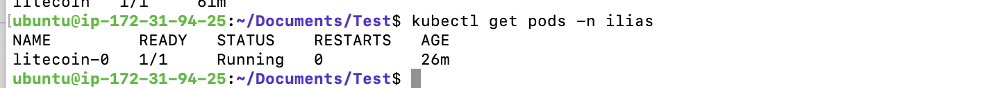
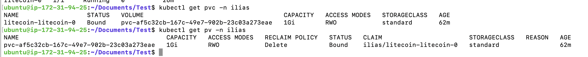

# Litecoin-test

## Question 1

Basic Litecoin Dockerfile has been taken from this [repository](https://github.com/uphold/docker-litecoin-core/tree/master/0.18)

### Checksum verification

Checksum verification has been already setup. Comment has been added for the checksum verification.

### Security Scan using [Anchore](https://anchore.com/blog/inline-scanning-with-anchore-engine/)

As a tool, Anchore has been used for docker image scanning. An inline scanning with anchore has been performed.

After building the Dockerfile using:
```
docker build -t litecoin:0.18.1 .
```

Time for scanning:

curl -s https://ci-tools.anchore.io/inline_scan-v0.6.0 | bash -s -- -f -d Dockerfile -b .anchore-policy.json litecoin:0.18.1

Scan result can be found below:



## Question 2

In order to deploy the stack as a statefulset:

### Environment setup 

first setup a quick Kubernetes environement using [Minikube](https://minikube.sigs.k8s.io/docs/start/)
```
minikube start
```
### Docker image build 
After installing Minikube, re-build the Docker image inside Minikube VM so it can be pulled from Kubernetes when deploying the statefulset.
```
docker build -t litecoin:0.18.1 .
```

### Configure & Deploy the StatefulSet

The statefulset has been configured in order to deploy the pod containing the container instance of the litecoin docker image as well as mounting/creating the PVC using volumeClaimTemplate & VolumeMount.
```
    spec:
      terminationGracePeriodSeconds: 10
      containers:
      - name: litecoin
        image: litecoin:0.18.1
        ports:
        - containerPort: 9332
          name: litecoin
        volumeMounts:
        - name: litecoin
          mountPath: /home/litecoin/.litecoin
  volumeClaimTemplates:
  - metadata:
      name: litecoin
    spec:
      accessModes: [ "ReadWriteOnce" ]
      resources:
        requests:
          storage: 1Gi

```

For full configuration, please check this [link](https://github.com/iliasnaamane/Litecoin-test/blob/master/2/ss.yml).

### Verification

Verify that the statefulset is correctly running & ready.


Verify that the pod deployed by the statefulset is correctly running & ready.


Verify that the PVC & PV has been correctly created and mounted.


## Question 3

Usually a basic CI/CD pipeline contains the following steps:

1) Build code & Install external package
2) Linter
3) Unit testing
4) Code Quality gate 
5) Build Docker image
6) Push Docker image to the registry / Artifactory
7) Deploy the docker image in K8s cluster.

As there is no code developed here, let's implement stage 5,6 & 7 using Gitlab-CI. 

### Build & Push Docker Image

```
buildpush:
  stage: build
  image:
    name: docker:stable
  services:
  - docker:stable-dind
  script:
    - docker build -t $REPO_NAME .
    - docker tag $REPO_NAME $REPO_REGISTRY_URL:$TAG
    - docker push $REPO_REGISTRY_URL:$TAG
    - docker rmi $REPO_NAME $REPO_REGISTRY_URL:$TAG
```

### Deploy

In order to deploy, first at least one single Gitlab runner into Kubernetes needs to be deployed following [Helm Chart](https://docs.gitlab.com/runner/install/kubernetes.html)

Gitlab runner is deployed as a Pod in order to execute the Gitlab job. The Helm chart should be configured before.

A new helm chart should be created as well in order to deploy the ecosystem. In our case, only statefulset needs to be deployed, so this element can be encapsulated inside a new Helm chart. The deployment stage should be similar to this:

```
deploy:
  stage: deploy
  image: alpine/helm:latest
  script:
    - helm init --client-only
    - helm --namespace $NAMESPACE upgrade -i $REPO_NAME --set image.tag=$TAG,env=$ENV,image.repository=$REPO_REGISTRY_URL $PATH_TO_VALUES
  tags:
    - k8s
    - dev
```

The final result of the Gitlab CI/CD pipeline should be similar to [this](https://github.com/iliasnaamane/Litecoin-test/blob/master/gitlab-ci.yml).

Another approach could be the usage of ArgoCD as it is easy to setup using Helm chart and in order to separate CI & Deployment tools. [GitOps - ArgoCD & Gitlab-CI](https://medium.com/@andrew.kaczynski/gitops-in-kubernetes-argo-cd-and-gitlab-ci-cd-5828c8eb34d6)


## Question 4

Make script in order to delete all non-attached litecoin docker images that have age between 4 hours and 8 hours:

```
docker rmi $(docker images -a  | grep hours | grep litecoin |  awk '3<$4 && $4<8' | awk '{print $3}')

```

Above, ``` docker images -a  | grep hours | grep litecoin ``` list all images that have litecoin and hours in age. ```  awk '3<$4 && $4<8' ``` is for filtering by age between 4 and 8. Last pipe ``` awk '{print $3}' ``` is to return images ids that will be given as an argument to ```docker rmi``` command in order to delete them.


## Question 5

The easiest way here is to run the previous shell script using Python but of course it is not the safest way. Running a shell exec is somehow risky in term of security and commands injections.

From my point of view, after a quick research a good way is to code the whole script in Python based on [docker-sdk](https://docker-py.readthedocs.io/en/stable/) library. 

## Question 6

I have rarely used Terraform in my past experiences. For policies I would recommend [Open policy agent](https://www.openpolicyagent.org/docs/v0.12.2/kubernetes-admission-control/) that handles policies through a [custom admission controller](https://kubernetes.io/docs/reference/access-authn-authz/extensible-admission-controllers/). The rules are made in Rego "Policy language" and implemented inside configmaps consumed by the webhook of OPA. The communication between components  must be over TLS. 

The usage of cert-manager can be useful for certificate management in case we use OPA as it is useful to handle certificate authorities, certificate injection and so on..

Also I have noticed that there is some roles here.. why don't we use basic Kubernetes roles, rolebindings clusterroles, groups users etc..

I can't go further for this question as I need more clarification and answers to some questions.


